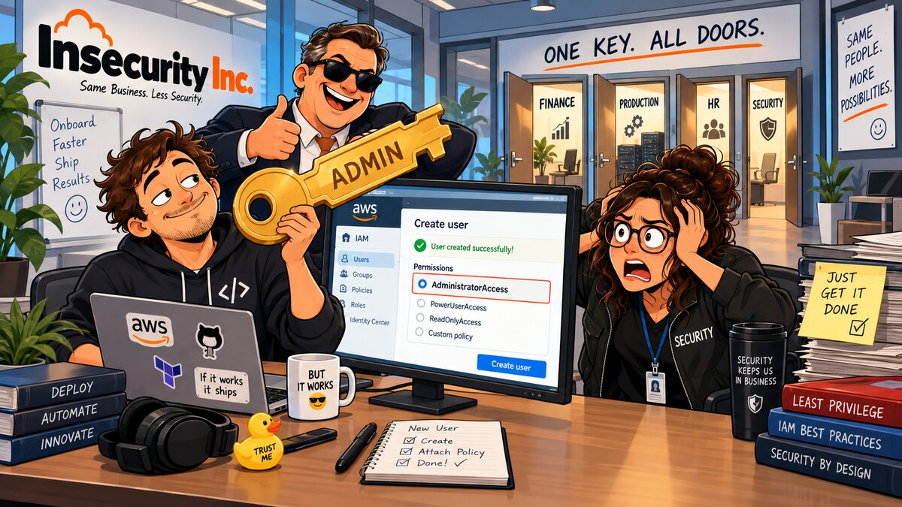

# 01 — 🔑 IAM Least Privilege



**Arco:** Identidade  
**Conceito:** Policy estática (RBAC)  
**Custo:** 🟢  

## 🎬 Cenário

A Insecurity Inc. colocou sua primeira aplicação em produção — um checkout de e-commerce rodando em algumas instâncias EC2 — e montou um plantão (on-call) para lidar com incidentes fora do horário comercial. Quando o checkout trava, a correção mais comum é chata e manual: reiniciar a instância. Para dar essa capacidade ao primeiro analista do plantão, o fundador faz o de sempre — entra no Console, cria um usuário IAM e anexa direto nele a política gerenciada pela AWS `AdministratorAccess`. "É só pra reiniciar a instância, mas AdministratorAccess resolve na hora."

Em JSON, o que foi anexado (diretamente ao usuário) é essencialmente isto:

```json
{
  "Version": "2012-10-17",
  "Statement": [
    {
      "Effect": "Allow",
      "Action": "*",
      "Resource": "*"
    }
  ]
}
```

## 🚨 O Problema

1. **Excesso de privilégio.** `AdministratorAccess` dá controle total sobre todos os serviços e recursos da conta — infinitamente mais do que reiniciar duas instâncias de uma aplicação. Isso é exatamente o antipadrão citado pelo AWS Well-Architected Framework: "defaulting to granting users administrator permissions" (SEC03-BP02 — *Grant least privilege access*).
2. **Policy anexada direto ao usuário.** Sem grupo ou role no meio, cada ajuste de permissão vira uma operação manual por pessoa — não escala e dificulta auditoria. É a violação descrita no CIS AWS Foundations Benchmark v3.0.0, controle 1.15 (*Ensure IAM Users Receive Permissions Only Through Groups*).
3. **Raio de explosão desnecessário.** Se a credencial desse analista vazar (commit acidental de access key, phishing, laptop comprometido), o atacante herda controle total da conta — não apenas a capacidade de reiniciar duas instâncias do checkout.

## ✅ A Correção

Este capítulo implementa RBAC via IAM Group + customer-managed policy escopada, seguindo o padrão "conceder apenas o que a função exige":

1. **Duas instâncias EC2 de exemplo** (`insecurity-inc-checkout-app-1` e `-2`) representando a aplicação real que o plantão precisa operar. Não rodam nada — existem só para dar ARNs concretos à policy. Sem IP público: este laboratório não precisa que elas sejam alcançáveis pela internet.
2. **Customer-managed IAM policy** (`insecurity-inc-oncall-sysops-policy`) com duas statements bem diferentes entre si — e essa diferença é o ponto central deste capítulo:
   - `ec2:StartInstances`, `ec2:StopInstances` e `ec2:RebootInstances`, com `Resource` apontando **exclusivamente** para os ARNs das duas instâncias do checkout. Essas ações suportam permissão a nível de recurso, então ficam presas a exatamente os recursos que o plantão precisa tocar — nada de `"Resource": "*"`.
   - `ec2:DescribeInstances`, com `Resource: "*"`. Diferente das ações acima, `DescribeInstances` **não suporta permissão a nível de recurso** — é uma limitação documentada da própria API do EC2 (a [Service Authorization Reference](https://docs.aws.amazon.com/service-authorization/latest/reference/list_amazonec2.html) lista, ação por ação, quais suportam ARN específico; a maioria dos `Describe*`/`List*` do EC2 não suporta). O plantão precisa localizar e checar o estado da instância antes de reiniciá-la, e a AWS simplesmente não oferece um jeito de escopar essa leitura a recursos específicos. Aceitar esse `"*"` pontual e documentado — em vez de esconder o problema ou generalizar o `"*"` para o resto da policy — é o comportamento correto: least privilege real, no EC2, quase sempre significa isolar rigorosamente as ações de mutação e tratar as de leitura amplas como uma concessão consciente, não um descuido.
3. **IAM Group** (`insecurity-inc-oncall-sysops`) recebendo a policy — nunca um usuário individual (CIS 1.15).
4. **IAM User** de exemplo (`insecurity-inc-oncall-analyst`) como membro do grupo, sem login de console e sem access key gerada pelo Terraform: credencial de longo prazo não deve viver no state, e o ciclo de vida de credenciais (rotação, MFA) é assunto do capítulo 04. O foco aqui é a estrutura de permissões, não como o analista de fato se autentica.

Com isso, mesmo que a credencial dessa identidade vaze, o atacante consegue no máximo listar/reiniciar duas instâncias específicas — não administrar a conta, nem tocar em qualquer outro recurso EC2.

## 🧪 Como aplicar

Três caminhos equivalentes — escolha o que fizer sentido para você. Os três criam os mesmos recursos, com os mesmos nomes, então dá para misturar.

> ⚠️ **Nota de custo:** diferente da maior parte deste capítulo (que é só IAM, gratuito), as duas instâncias EC2 cobram enquanto estiverem rodando (a conta usada não tem free tier). O custo de um `t3.micro` por poucos minutos de teste é irrisório (frações de centavo, cobrança por segundo, sem compromisso mínimo como KMS/Secrets Manager), mas não deixe rodando sem necessidade — teste e destrua/pare em seguida.

### 🏗️ Opção 1 — Terraform (caminho testado neste repo)

```bash
terraform init
terraform apply
```

Por padrão as instâncias sobem na subnet default da VPC default da conta/região (`var.subnet_id = ""`); se sua conta não tiver VPC default, informe `-var="subnet_id=<id-da-subnet>"`.

### ⌨️ Opção 2 — AWS CLI

```bash
# 1. Descobrir AMI (Amazon Linux 2023, via parâmetro público do SSM), VPC e subnet default
AMI_ID=$(aws ssm get-parameters \
  --names /aws/service/ami-amazon-linux-latest/al2023-ami-kernel-default-x86_64 \
  --query 'Parameters[0].Value' --output text)

VPC_ID=$(aws ec2 describe-vpcs --filters Name=isDefault,Values=true \
  --query 'Vpcs[0].VpcId' --output text)

SUBNET_ID=$(aws ec2 describe-subnets --filters Name=vpc-id,Values="$VPC_ID" \
  --query 'Subnets[0].SubnetId' --output text)

# 2. Criar as duas instâncias que representam o checkout (sem IP público)
INSTANCE_ID_1=$(aws ec2 run-instances \
  --image-id "$AMI_ID" \
  --instance-type t3.micro \
  --subnet-id "$SUBNET_ID" \
  --no-associate-public-ip-address \
  --tag-specifications 'ResourceType=instance,Tags=[{Key=Name,Value=insecurity-inc-checkout-app-1},{Key=project,Value=insecurity-inc},{Key=env,Value=lab},{Key=chapter,Value=01}]' \
  --query 'Instances[0].InstanceId' --output text)

INSTANCE_ID_2=$(aws ec2 run-instances \
  --image-id "$AMI_ID" \
  --instance-type t3.micro \
  --subnet-id "$SUBNET_ID" \
  --no-associate-public-ip-address \
  --tag-specifications 'ResourceType=instance,Tags=[{Key=Name,Value=insecurity-inc-checkout-app-2},{Key=project,Value=insecurity-inc},{Key=env,Value=lab},{Key=chapter,Value=01}]' \
  --query 'Instances[0].InstanceId' --output text)

# 3. Criar a policy least-privilege: describe amplo (limitação do EC2) +
#    start/stop/reboot só nas duas instâncias do checkout
ACCOUNT_ID=$(aws sts get-caller-identity --query Account --output text)
REGION=$(aws configure get region)

cat > /tmp/oncall-sysops-policy.json <<EOF
{
  "Version": "2012-10-17",
  "Statement": [
    {
      "Sid": "DescribeEC2Instances",
      "Effect": "Allow",
      "Action": "ec2:DescribeInstances",
      "Resource": "*"
    },
    {
      "Sid": "RestartCheckoutAppInstances",
      "Effect": "Allow",
      "Action": ["ec2:StartInstances", "ec2:StopInstances", "ec2:RebootInstances"],
      "Resource": [
        "arn:aws:ec2:${REGION}:${ACCOUNT_ID}:instance/${INSTANCE_ID_1}",
        "arn:aws:ec2:${REGION}:${ACCOUNT_ID}:instance/${INSTANCE_ID_2}"
      ]
    }
  ]
}
EOF

aws iam create-policy \
  --policy-name insecurity-inc-oncall-sysops-policy \
  --policy-document file:///tmp/oncall-sysops-policy.json \
  --description "Describe amplo (limitação da API do EC2) + start/stop/reboot só nas instâncias do checkout (least privilege)."
# guarde o Arn retornado
POLICY_ARN=<Arn retornado acima>

# 4. Criar o grupo e anexar a policy a ele (nunca a um usuário diretamente)
aws iam create-group --group-name insecurity-inc-oncall-sysops

aws iam attach-group-policy \
  --group-name insecurity-inc-oncall-sysops \
  --policy-arn "$POLICY_ARN"

# 5. Criar o usuário de exemplo e adicioná-lo ao grupo
aws iam create-user \
  --user-name insecurity-inc-oncall-analyst \
  --tags Key=project,Value=insecurity-inc Key=env,Value=lab Key=chapter,Value=01

aws iam add-user-to-group \
  --user-name insecurity-inc-oncall-analyst \
  --group-name insecurity-inc-oncall-sysops
```

### 🖥️ Opção 3 — Console (GUI)

1. **Criar as instâncias:** console **EC2** → **Launch instance** → nome `insecurity-inc-checkout-app-1` → AMI **Amazon Linux 2023** → tipo `t3.micro` → em **Network settings**, mantenha a VPC/subnet default e **desmarque** "Auto-assign public IP" → em **Tags**, adicione `project=insecurity-inc`, `env=lab`, `chapter=01` → **Launch instance**. Repita para `insecurity-inc-checkout-app-2`.
2. **Criar a policy:** console **IAM** → **Policies** → **Create policy** → aba **JSON** → cole o JSON da Opção 2 (com os ARNs reais das duas instâncias) → **Next** → nome `insecurity-inc-oncall-sysops-policy`, descrição "Describe amplo (limitação da API do EC2) + start/stop/reboot só nas instâncias do checkout (least privilege)." → **Create policy**.
3. **Criar o grupo:** **IAM** → **User groups** → **Create group** → nome `insecurity-inc-oncall-sysops` → em **Attach permissions policies**, marque `insecurity-inc-oncall-sysops-policy` → **Create group**.
4. **Criar o usuário:** **IAM** → **Users** → **Create user** → nome `insecurity-inc-oncall-analyst` → **não** marque "Provide user access to the AWS Management Console" (login não é necessário para este laboratório) → **Next** → em **Add user to group**, selecione `insecurity-inc-oncall-sysops` → **Create user**.

## 🧾 Como testar

Para confirmar na prática que o `insecurity-inc-oncall-analyst` só consegue reiniciar as duas instâncias do checkout (e recebe `AccessDenied` em qualquer outra coisa), é preciso dar a ele acesso de login — o que **não** é feito pelo Terraform deste capítulo de propósito: o recurso `aws_iam_user_login_profile` guardaria a senha no state, geralmente em texto plano. Crie a senha fora do Terraform, teste, e remova em seguida.

### ⌨️ Criar senha de teste — AWS CLI

```bash
# 1. Criar uma senha temporária de console para o usuário
aws iam create-login-profile \
  --user-name insecurity-inc-oncall-analyst \
  --password 'UmaSenhaForteAqui123!' \
  --password-reset-required
# --password-reset-required força trocar a senha no primeiro login; omita para testar mais rápido

# 2. Descobrir a URL de login da conta
ACCOUNT_ID=$(aws sts get-caller-identity --query Account --output text)
echo "https://${ACCOUNT_ID}.signin.aws.amazon.com/console"
```

Logue com esse usuário/senha na URL acima. No console, tente:

- **EC2 → Instances**: listar todas as instâncias da conta (não só as do checkout) deve funcionar — é a statement `DescribeInstances` com `Resource: "*"` fazendo o que ela existe para fazer.
- **EC2 → `insecurity-inc-checkout-app-1` ou `-2` → Instance state → Stop instance / Start instance / Reboot instance**: deve funcionar — é exatamente o que a policy autoriza.
- **EC2 → `insecurity-inc-checkout-app-1` ou `-2` → Instance state → Terminate instance**: deve dar **Access Denied** — a policy concede start/stop/reboot, não terminate, mesmo sendo a mesma instância.
- **Se você tiver outra instância EC2 na conta** (de outro laboratório, por exemplo): tentar Stop/Start/Reboot nela também deve dar **Access Denied** — prova que o escopo por ARN funciona mesmo a ação sendo idêntica.
- **Qualquer outro serviço** (S3, IAM, etc.): deve dar **Access Denied**.

Depois do teste, remova a senha:

```bash
aws iam delete-login-profile --user-name insecurity-inc-oncall-analyst
```

### 🖥️ Criar senha de teste — Console (GUI)

1. **IAM** → **Users** → `insecurity-inc-oncall-analyst` → aba **Security credentials** → **Console access** → **Enable** → gerar senha automática ou definir uma → **Apply**.
2. Copie a **Console sign-in URL** mostrada na mesma tela (ou monte `https://<account-id>.signin.aws.amazon.com/console`) e faça login em uma janela anônima/outro navegador.
3. Repita os testes de acesso descritos acima (describe amplo funciona, start/stop/reboot funcionam só nas duas instâncias do checkout, terminate e qualquer outro serviço dão `AccessDenied`).
4. Ao terminar, volte em **Security credentials** → **Console access** → **Manage** (ou **Disable**) para remover a senha.

## 🧹 Como destruir

Destrua pelo mesmo caminho que usou para aplicar (ou combine, já que os nomes de recurso são os mesmos nos três). Se você criou uma senha de console para testar (seção "Como testar"), remova-a antes — o Terraform não gerencia essa credencial e não vai tocar nela sozinho.

> **Erro comum:** `terraform destroy` falha com `DeleteConflict: Cannot delete entity, must delete login profile first` se a senha de teste ainda existir.  
Resolva com: `aws iam delete-login-profile --user-name insecurity-inc-oncall-analyst`  
 e rode novamente: `terraform destroy`

### 🏗️ Terraform

```bash
terraform destroy
```

### ⌨️ AWS CLI

```bash
aws iam remove-user-from-group \
  --user-name insecurity-inc-oncall-analyst \
  --group-name insecurity-inc-oncall-sysops

aws iam delete-user --user-name insecurity-inc-oncall-analyst

POLICY_ARN=$(aws iam list-policies --scope Local \
  --query "Policies[?PolicyName=='insecurity-inc-oncall-sysops-policy'].Arn" \
  --output text)

aws iam detach-group-policy \
  --group-name insecurity-inc-oncall-sysops \
  --policy-arn "$POLICY_ARN"

aws iam delete-group --group-name insecurity-inc-oncall-sysops

aws iam delete-policy --policy-arn "$POLICY_ARN"

aws ec2 terminate-instances --instance-ids "$INSTANCE_ID_1" "$INSTANCE_ID_2"
# se não tiver mais as variáveis salvas, descubra os IDs por tag:
# aws ec2 describe-instances \
#   --filters "Name=tag:Name,Values=insecurity-inc-checkout-app-1,insecurity-inc-checkout-app-2" "Name=instance-state-name,Values=running,stopped" \
#   --query 'Reservations[].Instances[].InstanceId' --output text
```

### 🖥️ Console (GUI)

1. **IAM** → **Users** → selecione `insecurity-inc-oncall-analyst` → **Delete**.
2. **IAM** → **User groups** → selecione `insecurity-inc-oncall-sysops` → **Delete** (se pedir para remover policies anexadas antes, desanexe `insecurity-inc-oncall-sysops-policy` primeiro).
3. **IAM** → **Policies** → filtre por *Customer managed* → selecione `insecurity-inc-oncall-sysops-policy` → **Delete**.
4. **EC2** → **Instances** → selecione `insecurity-inc-checkout-app-1` e `insecurity-inc-checkout-app-2` → **Instance state** → **Terminate instance** → confirme.

## 📚 Referências

- [SEC03-BP02 — Grant least privilege access](https://docs.aws.amazon.com/wellarchitected/latest/framework/sec_permissions_least_privileges.html) — AWS Well-Architected Framework, Security Pillar (SEC 3: *How do you manage permissions for people and machines?*).
- CIS AWS Foundations Benchmark v3.0.0, controle 1.15 — *Ensure IAM Users Receive Permissions Only Through Groups*.
- CIS AWS Foundations Benchmark v1.4.0, controle 1.16 — *Ensure IAM policies that grant full "*:*" administrative privileges are not created* ([mapeamento de controles no AWS Security Hub — IAM.1 e IAM.2](https://docs.aws.amazon.com/securityhub/latest/userguide/iam-controls.html)).
- [Actions, resources, and condition keys for Amazon EC2](https://docs.aws.amazon.com/service-authorization/latest/reference/list_amazonec2.html) — Service Authorization Reference; consulte a coluna "Resource types" de cada ação para saber quais suportam ARN específico (a maioria dos `Describe*`/`List*` não suporta, exigindo `Resource: "*"`).
- [IAM tutorial: Delegate access using IAM policies with conditions](https://docs.aws.amazon.com/IAM/latest/UserGuide/tutorial_delegate-permissions-with-conditions.html) e [Policies and permissions in IAM](https://docs.aws.amazon.com/IAM/latest/UserGuide/access_policies.html) — referência oficial para escrever policies escopadas por ação e recurso.
