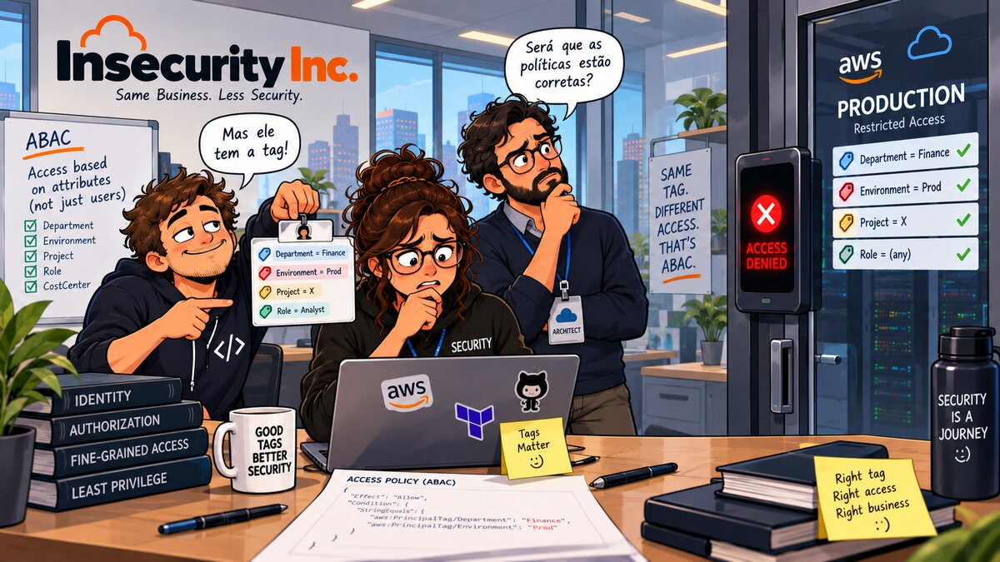

# 02 — 🏷️ ABAC



**Arco:** Identidade
**Conceito:** Policy dinâmica por tags
**Custo:** 🟢
**Depende de:** capítulo(s) 01

## 🎬 Cenário

O RBAC do capítulo 01 funcionou bem para o plantão do checkout. Mas a Insecurity Inc. continuou crescendo: hoje o time de **marketing** tem seu próprio painel de campanhas rodando numa instância EC2, e o time de **engenharia** tem uma instância de ferramentas internas. Seguindo à risca o padrão que "funcionou da última vez", o fundador repete a receita do capítulo 01 para cada app novo: uma instância, uma customer-managed policy escopada ao ARN dessa instância, um grupo.

No terceiro time, ao copiar e colar a policy do marketing para criar a da engenharia, alguém esquece de trocar o ARN da instância. O JSON que vai para o grupo `insecurity-inc-engineering-analysts` fica assim:

```json
{
  "Version": "2012-10-17",
  "Statement": [
    {
      "Sid": "RestartEngineeringAppInstance",
      "Effect": "Allow",
      "Action": ["ec2:StartInstances", "ec2:StopInstances", "ec2:RebootInstances"],
      "Resource": "arn:aws:ec2:us-east-1:<account-id>:instance/i-0a1b2c3d4e5f6g7h8"
    }
  ]
}
```

O ID da instância acima é o da app de **marketing** — não da de engenharia. O nome do grupo diz "engineering", a policy controla a instância de outro time. O erro só seria percebido quando alguém da engenharia reclamasse de não conseguir reiniciar a própria app — ou, pior, quando o marketing notasse que outro time consegue derrubar a aplicação deles.

## 🚨 O Problema

1. **Policy sprawl.** RBAC estático (capítulo 01) exige uma policy nova, escrita à mão, para cada combinação de time × instância. Com *N* times, são *N* instâncias, *N* policies e *N* grupos para manter e auditar — o esforço cresce linearmente (e o risco de erro, junto).
2. **Erro humano por copy-paste vira uma falha de segurança real.** O JSON acima não é hipotético: é o tipo de engano que acontece quando "criar acesso para um time novo" significa "duplicar o JSON do time anterior e editar o ARN certo". Um ID de instância esquecido concede controle cruzado entre times — start/stop/reboot é suficiente para causar uma indisponibilidade na aplicação errada.
3. **Auditoria não escala.** Para responder "quem pode reiniciar a app de marketing?" é preciso abrir e ler cada policy de cada grupo, uma a uma — não existe um único lugar ou uma única regra para consultar.

O AWS Well-Architected Framework — Security Pillar (SEC03-BP02, *Grant least privilege access*) aponta justamente essa limitação de escalar permissões via policies estáticas conforme o número de times/recursos cresce, e recomenda **attribute-based access control (ABAC)** como alternativa: em vez de uma policy por recurso, uma única policy cujo escopo é resolvido dinamicamente a partir de atributos (tags) da própria identidade e do próprio recurso.

## ✅ A Correção

Este capítulo reestrutura o acesso às instâncias como ABAC, reaproveitando o conceito do capítulo 01 (EC2 + IAM Group), mas trocando "uma policy por time" por "uma policy para todos os times" — e, diferente de uma primeira versão deste laboratório (que escopava acesso por pasta num bucket S3), usando o padrão de ABAC que a própria AWS demonstra no seu tutorial oficial: comparar a tag do **recurso** com a tag do **principal**, na própria condition da policy.

1. **Uma instância EC2 por time de exemplo** (`insecurity-inc-marketing-app`, `insecurity-inc-engineering-app`), cada uma tagueada com `access-project=<time>` além das tags padrão do projeto. Não rodam nada — existem só para dar um recurso real e tagueado à policy.
2. **Uma única customer-managed policy** (`insecurity-inc-abac-team-apps-policy`) que **não menciona nenhum time nem nenhum ARN de instância específico**:
   - `ec2:DescribeInstances`, com `Resource: "*"`. Assim como no capítulo 01, essa ação **não suporta permissão a nível de recurso** — limitação documentada da própria API do EC2 (a [Service Authorization Reference](https://docs.aws.amazon.com/service-authorization/latest/reference/list_amazonec2.html) lista, ação por ação, quais suportam ARN específico).
   - `ec2:StartInstances`, `ec2:StopInstances` e `ec2:RebootInstances`, com `Resource` escopado ao tipo `instance/*` da própria conta/região (essas ações suportam permissão a nível de recurso), mais uma `Condition` `StringEquals` comparando `aws:ResourceTag/access-project` (a tag da instância) com `${aws:PrincipalTag/access-project}` (a tag de quem está chamando a API). Nenhum ARN de instância é escrito na policy — o match acontece em tempo de avaliação.
   - Uma condição `Null` na segunda statement exige que a tag `access-project` exista no principal — sem ela, a AWS nega o acesso em vez de resolver a comparação de forma imprevisível. É a mesma mitigação recomendada pelo [tutorial de ABAC da AWS](https://docs.aws.amazon.com/IAM/latest/UserGuide/tutorial_attribute-based-access-control.html) (que usa exatamente EC2 + `access-project` como exemplo).
3. **Um único IAM Group** (`insecurity-inc-abac-analysts`) recebendo essa policy — de novo, nunca anexada direto a um usuário (CIS AWS Foundations Benchmark v3.0.0, controle 1.15).
4. **Um usuário IAM por time de exemplo** (`insecurity-inc-marketing-analyst`, `insecurity-inc-engineering-analyst`), todos no mesmo grupo, com a **mesma** policy — o que diferencia o acesso de cada um é só o valor da tag `access-project` (`marketing` ou `engineering`).

Onboarding de um time novo deixa de significar "escrever uma policy nova": significa criar a instância com a tag `access-project=<time>` e taguear a identidade correspondente. Nenhuma policy é tocada — e por isso o erro de copy-paste do cenário acima deixa de ser possível: não existe um segundo JSON para copiar, nem um ARN para esquecer de trocar.

Essa é também a razão pela qual o [CLAUDE.md](../CLAUDE.md#convenções) deste repositório insiste em tagging consistente desde o capítulo 00/01: ABAC não funciona sem tags corretas e presentes em toda identidade e recurso.

## 🧪 Como aplicar

Três caminhos equivalentes — escolha o que fizer sentido para você. Os três criam os mesmos recursos, com os mesmos nomes, então dá para misturar.

> ⚠️ **Nota de custo:** assim como no capítulo 01, as instâncias EC2 cobram enquanto estiverem rodando (a conta usada não tem free tier). O custo de `t3.micro` por poucos minutos de teste é irrisório, mas não deixe rodando sem necessidade — teste e destrua em seguida.

### 🏗️ Opção 1 — Terraform (caminho testado neste repo)

```bash
terraform init
terraform apply
```

Por padrão as instâncias sobem na subnet default da VPC default da conta/região (`var.subnet_id = ""`); se sua conta não tiver VPC default, informe `-var="subnet_id=<id-da-subnet>"`. Os times de exemplo (`marketing`, `engineering`) estão em `variables.tf`, na variável `teams`.

### ⌨️ Opção 2 — AWS CLI

```bash
# 1. Descobrir AMI (Amazon Linux 2023, via parâmetro público do SSM), VPC e subnet default
AMI_ID=$(aws ssm get-parameters \
  --names /aws/service/ami-amazon-linux-latest/al2023-ami-kernel-default-x86_64 \
  --query 'Parameters[0].Value' --output text)

VPC_ID=$(aws ec2 describe-vpcs --filters Name=isDefault,Values=true \
  --query 'Vpcs[0].VpcId' --output text)

SUBNET_ID=$(aws ec2 describe-subnets --filters Name=vpc-id,Values="$VPC_ID" \
  --query 'Subnets[0].SubnetId' --output text)

# 2. Criar uma instância por time, cada uma com a tag access-project correspondente
INSTANCE_ID_MARKETING=$(aws ec2 run-instances \
  --image-id "$AMI_ID" \
  --instance-type t3.micro \
  --subnet-id "$SUBNET_ID" \
  --no-associate-public-ip-address \
  --tag-specifications 'ResourceType=instance,Tags=[{Key=Name,Value=insecurity-inc-marketing-app},{Key=project,Value=insecurity-inc},{Key=env,Value=lab},{Key=chapter,Value=02},{Key=access-project,Value=marketing}]' \
  --query 'Instances[0].InstanceId' --output text)

INSTANCE_ID_ENGINEERING=$(aws ec2 run-instances \
  --image-id "$AMI_ID" \
  --instance-type t3.micro \
  --subnet-id "$SUBNET_ID" \
  --no-associate-public-ip-address \
  --tag-specifications 'ResourceType=instance,Tags=[{Key=Name,Value=insecurity-inc-engineering-app},{Key=project,Value=insecurity-inc},{Key=env,Value=lab},{Key=chapter,Value=02},{Key=access-project,Value=engineering}]' \
  --query 'Instances[0].InstanceId' --output text)

# 3. Criar a policy ABAC — uma só, sem nenhum time ou ARN de instância no JSON
ACCOUNT_ID=$(aws sts get-caller-identity --query Account --output text)
REGION=$(aws configure get region)

cat > /tmp/abac-team-apps-policy.json <<EOF
{
  "Version": "2012-10-17",
  "Statement": [
    {
      "Sid": "DescribeEC2Instances",
      "Effect": "Allow",
      "Action": "ec2:DescribeInstances",
      "Resource": "*"
    },
    {
      "Sid": "RestartOwnProjectInstanceOnly",
      "Effect": "Allow",
      "Action": ["ec2:StartInstances", "ec2:StopInstances", "ec2:RebootInstances"],
      "Resource": "arn:aws:ec2:${REGION}:${ACCOUNT_ID}:instance/*",
      "Condition": {
        "StringEquals": {"aws:ResourceTag/access-project": "\${aws:PrincipalTag/access-project}"},
        "Null": {"aws:PrincipalTag/access-project": "false"}
      }
    }
  ]
}
EOF

aws iam create-policy \
  --policy-name insecurity-inc-abac-team-apps-policy \
  --policy-document file:///tmp/abac-team-apps-policy.json \
  --description "Describe amplo (limitação da API do EC2) + start/stop/reboot só na instância cuja tag access-project bate com a do principal (ABAC)."
# guarde o Arn retornado
POLICY_ARN=<Arn retornado acima>

# 4. Criar o grupo e anexar a policy (uma única vez, para todos os times)
aws iam create-group --group-name insecurity-inc-abac-analysts

aws iam attach-group-policy \
  --group-name insecurity-inc-abac-analysts \
  --policy-arn "$POLICY_ARN"

# 5. Criar um usuário por time, cada um com a tag access-project correspondente
aws iam create-user \
  --user-name insecurity-inc-marketing-analyst \
  --tags Key=project,Value=insecurity-inc Key=env,Value=lab Key=chapter,Value=02 Key=access-project,Value=marketing

aws iam create-user \
  --user-name insecurity-inc-engineering-analyst \
  --tags Key=project,Value=insecurity-inc Key=env,Value=lab Key=chapter,Value=02 Key=access-project,Value=engineering

aws iam add-user-to-group --user-name insecurity-inc-marketing-analyst --group-name insecurity-inc-abac-analysts
aws iam add-user-to-group --user-name insecurity-inc-engineering-analyst --group-name insecurity-inc-abac-analysts
```

> Note o `\$` antes de `{aws:PrincipalTag...}` no heredoc: é só para o shell não tentar expandir a variável antes de gravar o arquivo. No Console (Opção 3) ou em qualquer editor comum, escreva `${aws:PrincipalTag/access-project}` normalmente, sem barra invertida.

### 🖥️ Opção 3 — Console (GUI)

1. **Criar as instâncias:** console **EC2** → **Launch instance** → nome `insecurity-inc-marketing-app` → AMI **Amazon Linux 2023** → tipo `t3.micro` → em **Network settings**, mantenha a VPC/subnet default e **desmarque** "Auto-assign public IP" → em **Tags**, adicione `project=insecurity-inc`, `env=lab`, `chapter=02`, `access-project=marketing` → **Launch instance**. Repita para `insecurity-inc-engineering-app` com `access-project=engineering`.
2. **Criar a policy:** console **IAM** → **Policies** → **Create policy** → aba **JSON** → cole o JSON da Opção 2 (com região/Account ID reais, sem as barras invertidas antes de `${...}`) → **Next** → nome `insecurity-inc-abac-team-apps-policy`, descrição "Describe amplo (limitação da API do EC2) + start/stop/reboot só na instância cuja tag access-project bate com a do principal (ABAC)." → **Create policy**.
3. **Criar o grupo:** **IAM** → **User groups** → **Create group** → nome `insecurity-inc-abac-analysts` → em **Attach permissions policies**, marque `insecurity-inc-abac-team-apps-policy` → **Create group**.
4. **Criar os usuários:** **IAM** → **Users** → **Create user** → nome `insecurity-inc-marketing-analyst` → **não** marque acesso ao Console → **Next** → em **Add user to group**, selecione `insecurity-inc-abac-analysts` → **Create user**. Depois, abra o usuário criado → aba **Tags** → **Add new tag** → chave `access-project`, valor `marketing`. Repita tudo para `insecurity-inc-engineering-analyst` com valor `engineering`.

## 🧾 Como testar

Diferente do capítulo 01 (uma identidade só), aqui o objetivo é comparar **duas** identidades com a mesma policy e ver o escopo divergir por causa da tag. Assim como no capítulo 01, o Terraform **não** gera credenciais — crie-as manualmente, teste, e remova em seguida.

```bash
# 1. Criar uma access key temporária para cada analista de teste
aws iam create-access-key --user-name insecurity-inc-marketing-analyst > /tmp/marketing-key.json
aws iam create-access-key --user-name insecurity-inc-engineering-analyst > /tmp/engineering-key.json

# 2. Configurar um profile local para cada uma (região explícita: um profile
#    novo não herda a região do profile default, e sem ela a CLI falha com
#    "NoRegion: You must specify a region")
REGION=$(aws configure get region)

aws configure set aws_access_key_id "$(jq -r .AccessKey.AccessKeyId /tmp/marketing-key.json)" --profile marketing-analyst
aws configure set aws_secret_access_key "$(jq -r .AccessKey.SecretAccessKey /tmp/marketing-key.json)" --profile marketing-analyst
aws configure set region "$REGION" --profile marketing-analyst

aws configure set aws_access_key_id "$(jq -r .AccessKey.AccessKeyId /tmp/engineering-key.json)" --profile engineering-analyst
aws configure set aws_secret_access_key "$(jq -r .AccessKey.SecretAccessKey /tmp/engineering-key.json)" --profile engineering-analyst
aws configure set region "$REGION" --profile engineering-analyst

# 3. Descobrir os IDs das duas instâncias
MARKETING_ID=$(aws ec2 describe-instances --filters Name=tag:Name,Values=insecurity-inc-marketing-app \
  --query 'Reservations[0].Instances[0].InstanceId' --output text)
ENGINEERING_ID=$(aws ec2 describe-instances --filters Name=tag:Name,Values=insecurity-inc-engineering-app \
  --query 'Reservations[0].Instances[0].InstanceId' --output text)

# 4. A analista de marketing só consegue reiniciar a própria instância
aws ec2 describe-instances --profile marketing-analyst > /dev/null && echo "describe: ok (Resource *)"

aws ec2 reboot-instances --instance-ids "$MARKETING_ID" --profile marketing-analyst    # funciona
aws ec2 reboot-instances --instance-ids "$ENGINEERING_ID" --profile marketing-analyst  # AccessDenied

# 5. O analista de engenharia vive o espelho: só a própria instância
aws ec2 reboot-instances --instance-ids "$ENGINEERING_ID" --profile engineering-analyst  # funciona
aws ec2 reboot-instances --instance-ids "$MARKETING_ID" --profile engineering-analyst    # AccessDenied

# 6. Terminate nunca é permitido, nem na própria instância — a policy só concede start/stop/reboot
aws ec2 terminate-instances --instance-ids "$MARKETING_ID" --profile marketing-analyst  # AccessDenied
```

A mesma policy, o mesmo grupo — o que muda o resultado é só a tag `access-project` de cada identidade comparada com a tag da instância. É essa a demonstração de que "uma regra, N times" funciona sem que a policy conheça nenhum ARN específico.

Depois do teste, revogue as access keys (elas são credenciais de longa duração — não deixe nenhuma viva além do necessário; ciclo de vida de credenciais é assunto do capítulo 04):

```bash
aws iam delete-access-key --user-name insecurity-inc-marketing-analyst \
  --access-key-id "$(jq -r .AccessKey.AccessKeyId /tmp/marketing-key.json)"
aws iam delete-access-key --user-name insecurity-inc-engineering-analyst \
  --access-key-id "$(jq -r .AccessKey.AccessKeyId /tmp/engineering-key.json)"
rm -f /tmp/marketing-key.json /tmp/engineering-key.json
```

## 🧹 Como destruir

Destrua pelo mesmo caminho que usou para aplicar (ou combine, já que os nomes de recurso são os mesmos nos três). Se você criou access keys de teste (seção "Como testar") e ainda não as revogou, remova-as antes — o Terraform não gerencia essas credenciais e não vai tocar nelas sozinho.

> **Erro comum:** `terraform destroy` falha com `DeleteConflict: Cannot delete entity, must delete access keys first` se alguma access key de teste ainda existir. Resolva listando e removendo as chaves de cada analista antes de destruir de novo:
>
> ```bash
> for TEAM in marketing engineering; do
>   USER="insecurity-inc-${TEAM}-analyst"
>   for KEY_ID in $(aws iam list-access-keys --user-name "$USER" --query 'AccessKeyMetadata[].AccessKeyId' --output text); do
>     aws iam delete-access-key --user-name "$USER" --access-key-id "$KEY_ID"
>   done
> done
> ```

### 🏗️ Terraform

```bash
terraform destroy
```

### ⌨️ AWS CLI

```bash
for TEAM in marketing engineering; do
  aws iam remove-user-from-group \
    --user-name "insecurity-inc-${TEAM}-analyst" \
    --group-name insecurity-inc-abac-analysts
  aws iam delete-user --user-name "insecurity-inc-${TEAM}-analyst"
done

POLICY_ARN=$(aws iam list-policies --scope Local \
  --query "Policies[?PolicyName=='insecurity-inc-abac-team-apps-policy'].Arn" \
  --output text)

aws iam detach-group-policy \
  --group-name insecurity-inc-abac-analysts \
  --policy-arn "$POLICY_ARN"

aws iam delete-group --group-name insecurity-inc-abac-analysts

aws iam delete-policy --policy-arn "$POLICY_ARN"

aws ec2 terminate-instances --filters Name=tag:Name,Values=insecurity-inc-marketing-app,insecurity-inc-engineering-app
# ou, se não tiver os IDs à mão:
# aws ec2 describe-instances \
#   --filters "Name=tag:Name,Values=insecurity-inc-marketing-app,insecurity-inc-engineering-app" "Name=instance-state-name,Values=running,stopped" \
#   --query 'Reservations[].Instances[].InstanceId' --output text
```

### 🖥️ Console (GUI)

1. **IAM** → **Users** → selecione `insecurity-inc-marketing-analyst` e `insecurity-inc-engineering-analyst` → **Delete** (um de cada vez).
2. **IAM** → **User groups** → selecione `insecurity-inc-abac-analysts` → **Delete** (se pedir para remover policies anexadas antes, desanexe `insecurity-inc-abac-team-apps-policy` primeiro).
3. **IAM** → **Policies** → filtre por *Customer managed* → selecione `insecurity-inc-abac-team-apps-policy` → **Delete**.
4. **EC2** → **Instances** → selecione `insecurity-inc-marketing-app` e `insecurity-inc-engineering-app` → **Instance state** → **Terminate instance** → confirme.

## 📚 Referências

- [SEC03-BP02 — Grant least privilege access](https://docs.aws.amazon.com/wellarchitected/latest/framework/sec_permissions_least_privileges.html) — AWS Well-Architected Framework, Security Pillar; discute ABAC como estratégia para escalar least privilege conforme o número de times/recursos cresce.
- [Attribute-based access control (ABAC) for AWS](https://docs.aws.amazon.com/IAM/latest/UserGuide/introduction_attribute-based-access-control.html) — visão geral oficial do IAM sobre ABAC, incluindo quando preferi-lo a RBAC.
- [IAM tutorial: Define permissions to access AWS resources based on tags](https://docs.aws.amazon.com/IAM/latest/UserGuide/tutorial_attribute-based-access-control.html) — tutorial oficial da AWS que usa exatamente EC2 + tag `access-project`, comparando `aws:ResourceTag` com `aws:PrincipalTag`; é o padrão implementado neste capítulo.
- [IAM JSON policy elements: Variables and tags](https://docs.aws.amazon.com/IAM/latest/UserGuide/reference_policies_variables.html) — referência da sintaxe `${aws:PrincipalTag/chave}` e das chaves `aws:ResourceTag`/`aws:PrincipalTag` usadas nas conditions.
- [Actions, resources, and condition keys for Amazon EC2](https://docs.aws.amazon.com/service-authorization/latest/reference/list_amazonec2.html) — Service Authorization Reference; confirma quais ações do EC2 suportam permissão a nível de recurso e a chave de condição `aws:ResourceTag`.
- CIS AWS Foundations Benchmark v3.0.0, controle 1.15 — *Ensure IAM Users Receive Permissions Only Through Groups* (a estrutura de grupo do capítulo 01 continua valendo aqui).
